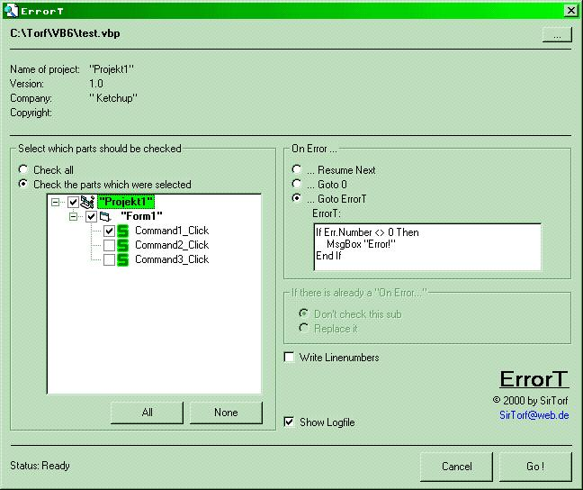



## ErrorT \(English version\)

### Description

This is the brand new English version of my project. As many of you wanted me to translate it, i tried to do. So here it is...

Remember: My program helps you to set "On Error..." and all these things to your projects.

There are many options, for example, you can make the program write linenumbers or you can change the errorcode... Just try...

PS: Dieses Programm existiert auch in deutscher Sprache !
 
### More Info
 

             |
---                |---
**Submitted On**   |2000-06-15 13:32:24
**By**             |[SirTorf](https://github.com/Planet-Source-Code/PSCIndex/blob/master/ByAuthor/sirtorf.md)
**Level**          |Intermediate
**User Rating**    |5.0 (10 globes from 2 users)
**Compatibility**  |VB 5\.0, VB 6\.0
**Category**       |[Debugging and Error Handling](https://github.com/Planet-Source-Code/PSCIndex/blob/master/ByCategory/debugging-and-error-handling__1-26.md)
**World**          |[Visual Basic](https://github.com/Planet-Source-Code/PSCIndex/blob/master/ByWorld/visual-basic.md)
**Archive File**   |[CODE\_UPLOAD67936152000\.zip](https://github.com/Planet-Source-Code/sirtorf-errort-english-version__1-8938/archive/master.zip)

